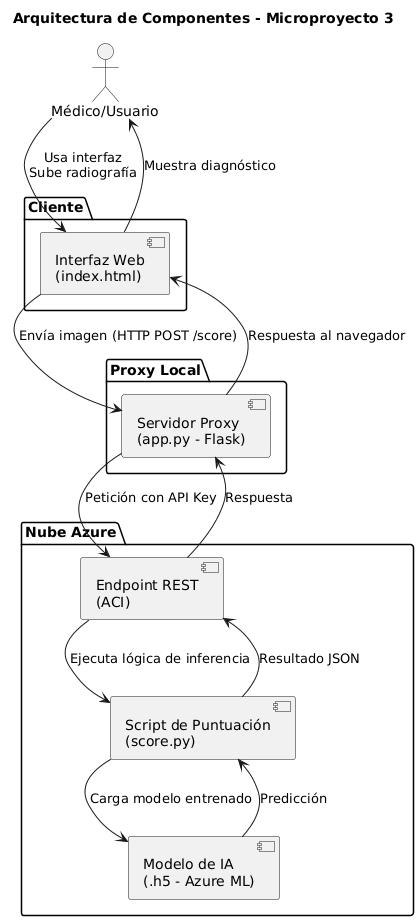

# Microproyecto 3 – Diagnóstico de Neumonía con Azure ML  

## Índice  
- Descripción  
- Problema y Justificación  
- Solución Propuesta  
- Arquitectura en Azure  
- Flujo de Trabajo  
- Instalación y Ejecución  
- Uso de la Interfaz Web  
- Resultados  
- Costos Estimados  
- Conclusiones  
- Estructura del Proyecto  
- Docker  
- Contribuidores  
- Licencia  

---

## Descripción  
Este proyecto implementa un sistema de **diagnóstico asistido por IA para neumonía**, utilizando un modelo de **red neuronal convolucional (CNN)** desplegado en **Azure Machine Learning**.  

El sistema clasifica radiografías de tórax en tres categorías:  
- Normal  
- Neumonía Viral  
- Neumonía Bacteriana  

Se incluye un servicio web modular que permite cargar imágenes y obtener resultados en segundos, asegurando accesibilidad y bajo costo.  

---

## Problema y Justificación  
En clínicas rurales no siempre se cuenta con radiólogos, lo cual retrasa la detección de neumonía y puede llevar a complicaciones. Contratar especialistas o adquirir software comercial es costoso y poco viable.  

El uso de **IA en la nube con Azure ML** permite ofrecer un sistema accesible, económico y escalable, que apoya a los médicos en la toma de decisiones sin sustituir su criterio clínico.  

---

## Solución Propuesta  
La propuesta es una aplicación web que interactúa con un **servidor proxy local** y un **servicio REST en Azure Container Instances (ACI)**. El modelo entrenado se ejecuta en la nube, protegido por credenciales seguras, y devuelve la clasificación de la radiografía junto con un mapa de calor generado con **Grad-CAM**.  

---

## Arquitectura en Azure  

El sistema sigue una arquitectura cliente–servidor–nube:  

1. El médico accede a la **interfaz web (index.html)** desde su navegador.  
2. La radiografía seleccionada se envía al **servidor proxy local (app.py)**.  
3. El proxy añade la **API Key de Azure** y reenvía la petición al **endpoint REST en Azure (ACI)**.  
4. El **script score.py** procesa la imagen, carga el modelo y realiza la predicción.  
5. El resultado (JSON con clase y probabilidad) se devuelve al navegador.  

📌 **Diagrama de Componentes:**  
  

---

## Flujo de Trabajo  

- **Interfaz Web (HTML/JS):** permite cargar imágenes y visualizar resultados.  
- **Servidor Proxy (Flask):** protege credenciales y comunica con Azure.  
- **Azure Container Instances:** ejecuta el **modelo entrenado (.h5)** mediante el **script score.py**.  
- **Grad-CAM:** genera mapas de calor que muestran las regiones relevantes para la predicción.  

---

## Instalación y Ejecución  

1. Clonar el repositorio:  
   ```bash
   git clone https://github.com/JSebastianSanchezN/MicroProyecto3Computacion.git
   cd MicroProyecto3Computacion
   ```  

2. Configurar variables de entorno:  
   Crear un archivo `.env` con la clave del servicio de Azure:  
   ```env
   AZURE_API_KEY=tu_api_key
   AZURE_ENDPOINT=https://<tu-endpoint>.azurecontainer.io/score
   ```  

3. Ejecutar el **servidor proxy local**:  
   ```bash
   Python run app.py 
   ```  

4. Abrir en el navegador la **interfaz web (index.html)** servida por Flask.  

⚠️ **Nota:** El modelo **NO se ejecuta localmente**. Toda la inferencia se procesa en el **endpoint de Azure** desplegado en **Container Instances (ACI)** mediante el script `score.py`.  

---

## Uso de la Interfaz Web  

1. Ingrese la cédula del paciente.  
2. Presione **Cargar Imagen** y seleccione una radiografía (JPG, PNG o DICOM).  
3. Presione **Predecir** para obtener el resultado.  
4. Opciones adicionales: **Guardar resultados en CSV**, **exportar a PDF** o **reiniciar proceso**.  

---

## Resultados  

El sistema entrega:  
- Radiografía original.  
- Imagen procesada.  
- Clasificación del modelo (Normal / Viral / Bacteriana).  
- Probabilidad asociada.  
- Mapa de calor (Grad-CAM).  

---

## Costos Estimados  

Según la calculadora de Azure:  
- **Azure ML Workspace:** costo insignificante.  
- **Azure Container Instance (1 vCPU, 1 GB RAM):** entre **USD $1.5 y $3.0 al mes** con 1 hora de uso diario.  

Esto hace que la solución sea **viable y sostenible económicamente**.  

---

## Conclusiones  

- El sistema demuestra que es posible implementar una **herramienta de apoyo clínico accesible y de bajo costo** en zonas rurales.  
- El uso de **Azure ML y CNN** permite obtener diagnósticos rápidos y confiables.  
- La arquitectura con **proxy local y servicios en la nube** garantiza seguridad y escalabilidad.  
- Aunque no sustituye al criterio médico, constituye un recurso valioso para mejorar la atención.  

---

## Estructura del Proyecto  

```plaintext
MicroProyecto3Computacion/
├── data/                   # Datos de prueba
│   ├── DICOM/              # Radiografías en formato DICOM
│   │     ├── normal (2).dcm
│   │     ├── normal (3).dcm
│   │     ├── viral (2).dcm
│   │     └── viral (3).dcm
│   │
│   ├── JPG/                # Radiografías en formato JPG/JPEG
│   │     ├── Prueba.jpg
│   │     └── Prueba2.jpeg
│
├── app.py                  # Servidor proxy en Flask
├── arquitectura_de_componentes.png   # Diagrama de arquitectura
├── Dockerfile.txt          # Archivo Docker para empaquetar el entorno
├── generate_test_json.py   # Script para generar peticiones de prueba
├── index.html              # Interfaz web (cliente)
├── requirements.txt        # Dependencias del proyecto
├── score.py                # Script de puntuación desplegado en Azure
├── LICENSE                 # Licencia MIT
├── README.md               # Documentación del proyecto
└── .gitignore              # Archivos y carpetas ignoradas por Git

```  

---

## Contribuidores  

- Johan Sebastian Sanchez Navas – [GitHub](https://github.com/JSebastianSanchezN)  
- Angel David Duarte Loaiza – [GitHub](https://github.com/AngelDDL)  
- Sharis Aranxa Barbosa Prado – [GitHub](https://github.com/SAranxa)  
- Santiago Cortes Murcia – [GitHub](https://github.com/SantiagoCorM)  

---

## Licencia  

Este proyecto se distribuye bajo la licencia MIT.

Ver archivo [LICENSE](LICENSE) para más detalles.

